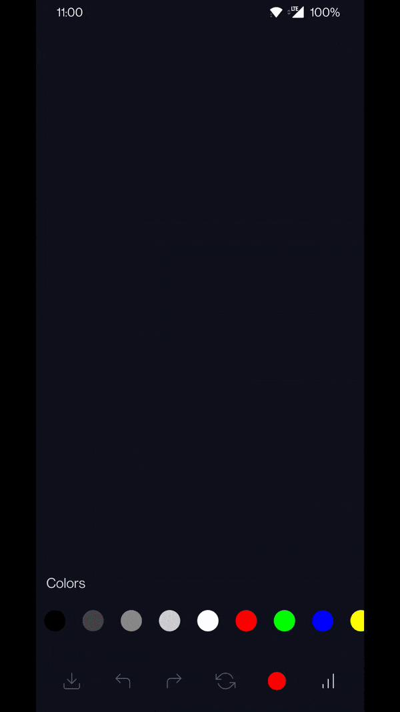

# DrawBox

[](https://androidweekly.net/issues/issue-502)
[](https://android-arsenal.com/details/1/8292)
[](https://mailchi.mp/kotlinweekly/kotlin-weekly-294)
[](https://search.maven.org/artifact/io.ak1/drawbox)
[](https://devlibrary.withgoogle.com/products/android/repos/akshay2211-DrawBox)

DrawBox is a multi-purpose tool to draw anything on canvas, written completely on jetpack compose.

## Features
* Customisable stoke size and color
* Inbuilt Undo and Redo options
* Reset option
* Easy Implementations
* Export feature to store history localy
* Written on Jetpack-Compose

## Demo


## Usage
 ```kotlin
 val controller = rememberDrawController()
 
 DrawBox(drawController = controller, modifier = Modifier.fillMaxSize().weight(1f, true))
 ```
With multiple methods in DrawController
```kotlin
* setStrokeColor(color: Color)
* setStrokeWidth(width: Float)
* unDo()
* reDo()
* reset()
* getDrawBoxBitmap()    // gives the result bitmap from canvas
* importPath(path)
* exportPath()
```

## Download
[](https://search.maven.org/artifact/io.ak1/drawbox) or grab via Gradle:
 
include in app level build.gradle
 ```groovy
 repositories {
    mavenCentral()
 }
 ```
```groovy
 implementation  'io.ak1:drawbox:1.0.3'
```
or Maven:
```xml
<dependency>
  <groupId>io.ak1</groupId>
  <artifactId>drawbox</artifactId>
  <version>1.0.3</version>
  <type>pom</type>
</dependency>
```
or ivy:
```xml
<dependency org='io.ak1' name='drawbox' rev='1.0.3'>
  <artifact name='drawbox' ext='pom' ></artifact>
</dependency>
```

## Thanks to
[RangVikalp](https://github.com/akshay2211/rang-vikalp) for the beautiful color picker used in DrawBox

## License
Licensed under the Apache License, Version 2.0, [click here for the full license](/LICENSE).

## Author & support
This project was created by [Akshay Sharma](https://akshay2211.github.io/).

> If you appreciate my work, consider buying me a cup of :coffee: to keep me recharged :metal: by [PayPal](https://www.paypal.me/akshay2211)

> I love using my work and I'm available for contract work. Freelancing helps to maintain and keep [my open source projects](https://github.com/akshay2211/) up to date!

