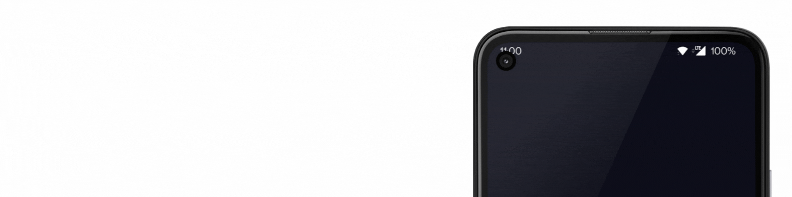
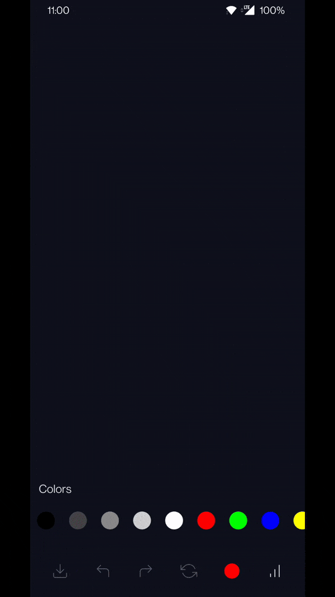

# DrawBox

[](https://androidweekly.net/issues/issue-502)
[](https://android-arsenal.com/details/1/8292)
[](https://mailchi.mp/kotlinweekly/kotlin-weekly-294)
[](https://search.maven.org/artifact/io.ak1/drawbox)
[](https://devlibrary.withgoogle.com/products/android/repos/akshay2211-DrawBox)

DrawBox is a powerful, cross-platform drawing library built with Kotlin Multiplatform (KMP) and Jetpack Compose. Create beautiful drawings with an intuitive canvas experience across Android, iOS, Web, and Desktop.

## Features
* **Multiplatform Support**: Native support for Android, iOS, Web (WASM), and JVM platforms
* **Multiple Drawing Modes**: Freehand pen, rectangles, circles, triangles, arrows, and lines
* **Rich Customization**: 
  - Customizable stroke size and color
  - Opacity/alpha control for transparency
  - Background color customization
* **Full Undo/Redo** support with history tracking
* **Export Formats**: 
  - SVG export for vector graphics
  - JSON export for preserving drawing state
  - Bitmap export for raster images
* **Reset and Clear** canvas functionality
* **Modern Architecture**: MVI pattern with proper state management
* **Easy Integration**: Simple composable API with comprehensive documentation

## Demo


## Usage

### Basic Setup
```kotlin
@Composable
fun DrawingScreen() {
    val controller = rememberDrawBoxController()
    val state by controller.state.collectAsState()
    
    Column(modifier = Modifier.fillMaxSize()) {
        DrawBox(
            state = state,
            onIntent = controller::onIntent,
            modifier = Modifier.fillMaxSize().weight(1f)
        )
    }
}
```

### Controller API
```kotlin
// Drawing Modes
controller.setMode(Mode.PEN)          // Freehand drawing
controller.setMode(Mode.RECTANGLE)    // Rectangle shapes
controller.setMode(Mode.CIRCLE)       // Circle shapes
controller.setMode(Mode.TRIANGLE)     // Triangle shapes
controller.setMode(Mode.ARROW)        // Arrows
controller.setMode(Mode.LINE)         // Lines

// Customization
controller.setColor(Color.Blue)       // Set stroke color
controller.setStrokeWidth(5f)         // Set stroke width
controller.setOpacity(0.8f)           // Set transparency (0.0-1.0)
controller.setBgColor(Color.White)    // Set background color

// History Management
controller.undo()                     // Undo last action
controller.redo()                     // Redo last undone action
controller.reset()                    // Clear canvas

// Export & Import
controller.exportPath()               // Export as JSON
controller.exportSvg()                // Export as SVG
controller.importPath(jsonString)     // Import from JSON
controller.saveBitmap()               // Save as bitmap

// State Monitoring
controller.canUndo.collect { ... }    // Monitor undo availability
controller.canRedo.collect { ... }    // Monitor redo availability
controller.events.collect { event ->  // Listen to events
    when (event) {
        is Event.SvgExported -> saveFile(event.svg)
        is Event.PngSaved -> processImage(event.bitmap)
        is Event.Error -> showError(event.message)
        else -> {}
    }
}
```

## Download

Latest Version: **2.0.0-alpha02** (KMP Preview)

[](https://search.maven.org/artifact/io.ak1/drawbox) or grab via Gradle:

### Gradle (KTS)
```kotlin
repositories {
    mavenCentral()
}

dependencies {
    implementation("io.ak1:drawbox:2.0.0-alpha02")
}
```

### Gradle (Groovy)
```groovy
repositories {
    mavenCentral()
}

dependencies {
    implementation 'io.ak1:drawbox:2.0.0-alpha02'
}
```

### Maven
```xml
<dependency>
  <groupId>io.ak1</groupId>
  <artifactId>drawbox</artifactId>
  <version>2.0.0-alpha02</version>
</dependency>
```

### Ivy
```xml
<dependency org='io.ak1' name='drawbox' rev='2.0.0-alpha02'>
  <artifact name='drawbox' ext='pom' ></artifact>
</dependency>
```

## What's New in 2.0.0

### Kotlin Multiplatform Migration
- **Complete KMP rewrite** - Now supports Android, iOS, Web (WASM), and JVM platforms with a single codebase
- **Shared architecture** - Core drawing logic and state management shared across all platforms
- **Platform-specific implementations** - Optimized image saving and rendering for each platform

### Architecture Improvements
- **MVI Pattern**: Modern state management with Model-View-Intent architecture
- **Immutable State**: Functional state updates ensure predictable behavior
- **Event-Driven**: Side effects handled through a reactive event system
- **Type-Safe**: Sealed classes for modes, intents, and events

### New Features
- **Multiple Drawing Modes**: Draw rectangles, circles, triangles, arrows, and lines
- **SVG Export**: Export drawings as vector graphics for scalability
- **Enhanced Customization**: Control opacity, background color, and more
- **Improved State Management**: Better control over drawing history and canvas state
- **Documentation**: Auto-generated Dokka documentation for better API visibility
- **Code Quality**: Spotless code formatting for consistent style

## Thanks to
[RangVikalp](https://github.com/akshay2211/rang-vikalp) for the beautiful color picker used in DrawBox

## License
Licensed under the Apache License, Version 2.0, [click here for the full license](/LICENSE).

## Author & support
This project was created by [Akshay Sharma](https://akshay2211.github.io/).

> If you appreciate my work, consider buying me a cup of :coffee: to keep me recharged :metal: by [PayPal](https://www.paypal.me/akshay2211)

> I love using my work and I'm available for contract work. Freelancing helps to maintain and keep [my open source projects](https://github.com/akshay2211/) up to date!

