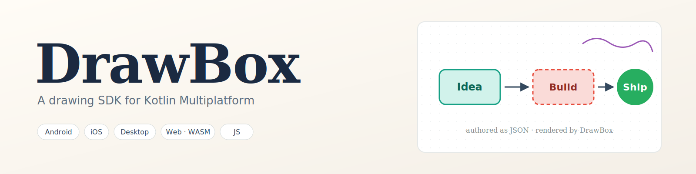
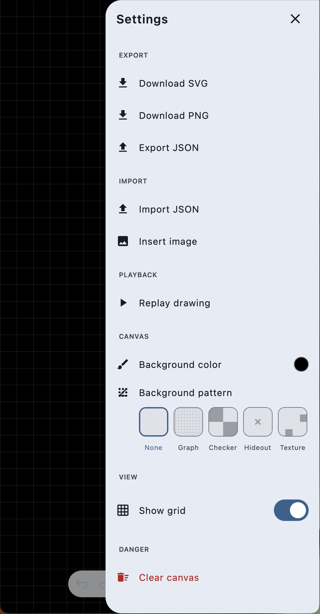
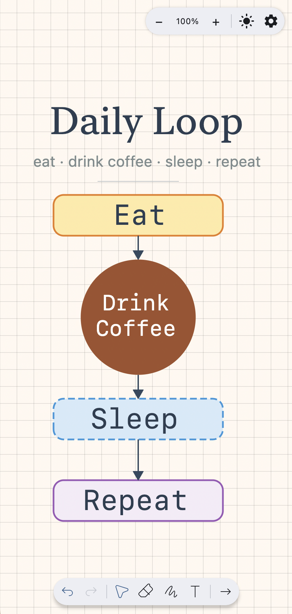
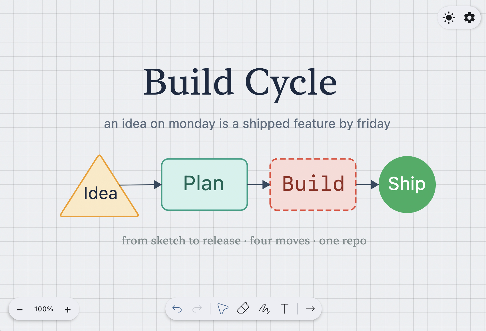

<picture>
  <source media="(prefers-color-scheme: dark)" srcset="media/banner-dark.svg">
  <source media="(prefers-color-scheme: light)" srcset="media/banner.svg">
  
</picture>

# DrawBox

[](https://androidweekly.net/issues/issue-502)
[](https://androidweekly.net/issues/issue-733)
[](https://android-arsenal.com/details/1/8292)
[](https://mailchi.mp/kotlinweekly/kotlin-weekly-294)
[](https://search.maven.org/artifact/io.ak1/drawbox)
[](https://devlibrary.withgoogle.com/products/android/repos/akshay2211-DrawBox)
[](https://klibs.io/project/akshay2211/DrawBox)
[](https://ak1.io/blog/2026/06/23/drawbox-goes-multiplatform/)


[](LICENSE)
[](https://github.com/akshay2211/DrawBox/stargazers)
[](https://github.com/akshay2211/DrawBox/network/members)
[](https://github.com/akshay2211/DrawBox/graphs/contributors)
[](https://github.com/akshay2211/DrawBox/commits/main)
[](#community--maintenance)

<a href="https://trendshift.io/repositories/40007?utm_source=trendshift-badge&amp;utm_medium=badge&amp;utm_campaign=badge-trendshift-40007" target="_blank" rel="noopener noreferrer"></a>

DrawBox is a Kotlin Multiplatform drawing SDK for Compose Multiplatform. It helps developers embed editable drawing, annotation, diagramming, and export capabilities across Android, iOS, Web, and Desktop from one shared Kotlin codebase.

> **Maintainer response policy:** issues and pull requests receive a first response within 7 days. Security reports go through [SECURITY.md](SECURITY.md).

## Try it Live

Run the sample right in your browser — no install required:

**[Open the live WASM sample →](https://akshay2211.github.io/DrawBox/sample/)**

[](https://ak1.io/DrawBox/sample/)

## Features

**Cross-platform, one codebase**
- Ships to Android, iOS, Desktop (JVM), Web (WASM), and Kotlin/JS browser from a single shared module.
- Pure Compose Multiplatform — no per-platform UI forks.

**Drawing primitives**
- Freehand pen with pressure / tilt / azimuth sampling on Apple Pencil and S Pen (mouse and capacitive touch default to unit pressure with zero overhead).
- Shape tools: rectangle, circle, triangle, arrow, line — each with stroke, fill, corner radius, and dashed / dotted stroke styles.
- Independent fill + stroke per shape, including explicit "no fill" and "no stroke" states.

**Rich elements**
- **Image element** — place, transform, rotate, and export bitmaps; bytes are the source of truth, decoded lazily with a mip-level cache so panning large images stays smooth.
- **Text element** — block-level plain text with inline editor, font family / size / alignment controls, and SVG export.
- **Connectors** with auto-snapping endpoints that anchor to the facing side midpoint of the target shape and follow rotation.

**Editing**
- Infinite canvas with zoom, pan (space-bar / middle-mouse / two-finger / scroll wheel), and a world-space cursor overlay that scales with zoom.
- Object eraser tool with lazy history snapshots — a full sweep across N elements undoes as a single revision.
- Full undo / redo, multi-select with drag and scale.

**Import / export**
- **SVG** export for vector output.
- **PNG** export for raster output.
- **JSON** import + export of the entire drawing state — round-trippable, human-editable. See [`samples/`](samples/) for ready-made examples.
- **Image insertion** from the native picker, drag-and-drop (Desktop), or clipboard paste (Desktop, Web, Android, iOS).

**Architecture**
- MVI pattern with immutable state, sealed `Intent` / `Event` / `Mode` / `State` types.
- `2.0` public surfaces (`DrawBoxController`, `Mode`, `Intent`, `Event`, `State`) frozen under semver; incubating surfaces opt in via explicit annotations.

## Demo

A short walkthrough of the SDK in action — pen, shapes, transforms, and the import / export pipeline.

<video src="https://github.com/user-attachments/assets/7e319a52-9a84-492c-9b1d-7babcc88e9d8" controls muted loop></video>

<details>
<summary><strong>More demo footage</strong></summary>

Drawing and shape editing — pen pressure, shapes with independent fill / stroke, multi-select transforms.

<video src="https://github.com/user-attachments/assets/05ec40c4-971e-44c5-a8e7-090d4e544fd9" controls muted loop></video>

Import / export round-trip — JSON in, edits, JSON out, plus SVG and PNG export.

<video src="https://github.com/user-attachments/assets/bd68ccad-d05a-4778-8950-7efaa6d9c62b" controls muted loop></video>

</details>

### Sample app — settings drawer

The bundled sample exposes the full SDK surface through a single settings drawer so you can probe each capability without writing host code.

<p align="center">
  
</p>

| Section | What it controls |
| --- | --- |
| **Export** | `Download SVG` writes the current scene as scalable vector XML. `Download PNG` rasterises the visible canvas. `Export JSON` serialises the entire scene (background, elements, styles) to a portable text file. |
| **Import** | `Import JSON` loads a previously exported scene or any compatible JSON payload (try the files in [`samples/`](samples/)). `Insert image` opens the platform-native picker and places the chosen bitmap as an editable `Element.Image`. |
| **Playback** | `Replay drawing` re-plays the strokes in the order they were created — useful for tutorials, time-lapses, or debugging stroke ordering. |
| **Canvas** | `Background color` swaps the canvas tint. `Background pattern` toggles between `None`, `Graph`, `Checker`, `Hideout`, and `Texture` — all tileable SVG patterns rendered through Skia. |
| **View** | `Show grid` toggles a world-space grid overlay that scales with zoom. |
| **Danger** | `Clear canvas` removes every element. Snapshot-backed, so a single undo restores the cleared scene. |

### Built entirely from JSON

Drawings are serialised as plain JSON (`{ "bgColor": "...", "elements": [...] }`), which means a flowchart can be authored or programmatically generated and then imported into the SDK. The two scenes below were rendered by importing the sample files in [`samples/`](samples/) — no manual drawing involved.

<table>
  <tr>
    <td align="center" width="50%">
      <br/>
      <sub><a href="samples/DrawBox-daily-loop.json"><code>samples/DrawBox-daily-loop.json</code></a> — portrait flow with mixed shapes, dashed strokes, a curved loop-back arrow, multi-line text, and connector bindings that auto-snap to the bound shape's facing side.</sub>
    </td>
    <td align="center" width="50%">
      <br/>
      <sub><a href="samples/DrawBox-build-cycle.json"><code>samples/DrawBox-build-cycle.json</code></a> — landscape pipeline exercising every shape type (triangle, rectangle, circle), all three stroke styles (solid, dashed, dotted), and three font families (serif, sans, mono).</sub>
    </td>
  </tr>
</table>

> To try them yourself: open the sample app, tap **Settings → Import → Import JSON**, and paste the contents of either file.

## Usage

### Basic Setup
```kotlin
@Composable
fun DrawingScreen() {
    val controller = rememberDrawBoxController()
    val state by controller.state.collectAsState()
    
    Column(modifier = Modifier.fillMaxSize()) {
        DrawBox(
            state = state,
            onIntent = controller::onIntent,
            modifier = Modifier.fillMaxSize().weight(1f)
        )
    }
}
```

### Controller API
```kotlin
// Drawing Modes
controller.setMode(Mode.PEN)          // Freehand drawing
controller.setMode(Mode.RECTANGLE)    // Rectangle shapes
controller.setMode(Mode.CIRCLE)       // Circle shapes
controller.setMode(Mode.TRIANGLE)     // Triangle shapes
controller.setMode(Mode.ARROW)        // Arrows
controller.setMode(Mode.LINE)         // Lines

// Customization
controller.setColor(Color.Blue)       // Set stroke color
controller.setStrokeWidth(5f)         // Set stroke width
controller.setOpacity(0.8f)           // Set transparency (0.0-1.0)
controller.setBgColor(Color.White)    // Set background color

// History Management
controller.undo()                     // Undo last action
controller.redo()                     // Redo last undone action
controller.reset()                    // Clear canvas

// Export & Import
controller.exportPath()               // Export as JSON
controller.exportSvg()                // Export as SVG
controller.importPath(jsonString)     // Import from JSON
controller.saveBitmap()               // Save as bitmap

// State Monitoring
controller.canUndo.collect { ... }    // Monitor undo availability
controller.canRedo.collect { ... }    // Monitor redo availability
controller.events.collect { event ->  // Listen to events
    when (event) {
        is Event.SvgExported -> saveFile(event.svg)
        is Event.PngSaved -> processImage(event.bitmap)
        is Event.Error -> showError(event.message)
        else -> {}
    }
}
```

## Download

Latest Version: **2.1.0-alpha02** (KMP Preview)

[](https://search.maven.org/artifact/io.ak1/drawbox) or grab via Gradle:

### Gradle (KTS)
```kotlin
repositories {
    mavenCentral()
}

dependencies {
    implementation("io.ak1:drawbox:2.1.0-alpha02")
}
```

### Gradle (Groovy)
```groovy
repositories {
    mavenCentral()
}

dependencies {
    implementation 'io.ak1:drawbox:2.1.0-alpha02'
}
```

### Maven
```xml
<dependency>
  <groupId>io.ak1</groupId>
  <artifactId>drawbox</artifactId>
  <version>2.1.0-alpha02</version>
</dependency>
```

### Ivy
```xml
<dependency org='io.ak1' name='drawbox' rev='2.1.0-alpha02'>
  <artifact name='drawbox' ext='pom' ></artifact>
</dependency>
```

> Full version history and the `1.x → 2.x` migration guide live in [CHANGELOG.md](CHANGELOG.md).

## What's New in 2.1.0-alpha01

First pre-release of the `2.1` line. The frozen `2.0` surfaces (`DrawBoxController`, `Mode`, `Intent`, `Event`, `State`) are extended only — see the [migration guide](CHANGELOG.md#migration-20x--21x) for the one structural change inside `Element.Path` made to accommodate pen-pressure data.

### Highlights
- **Image element** (`Element.Image`, `Mode.IMAGE`) — place, transform, and export bitmaps as first-class canvas elements.
- **Text element** (`Element.Text`, `Mode.TEXT`) — block-level plain text with inline editor, font controls, and SVG export.
- **Pen pressure** sampling on PEN and ERASER modes. New `Element.PathSample` carries `position`, `width`, and optional `tilt` / `azimuth` from Apple Pencil and S Pen. Mouse / capacitive touch defaults to unit pressure with zero overhead.
- **Cross-platform image inputs** under `io.ak1.drawbox.input`:
    - `pasteImageFromClipboard(...)` — JVM, Web (WasmJS + JS), Android, iOS.
    - `Modifier.imageDragAndDropTarget(...)` — real on Desktop; documented stubs on iOS / Web pending Compose Multiplatform API support.
    - iOS PHPicker wired for native image insertion.
- **Kotlin/JS browser target** alongside the existing Android / iOS / JVM / WASM artifacts.
- **Independent fill + stroke** on `Element.Shape` with explicit "none" states for both.
- **Connector side-anchoring** — arrow endpoints snap to the facing side midpoint of their bound shape, rotation-aware.
- **Async + downsampled image decode** with a mip-level cache (internal perf, no API change).
- Roborazzi-based snapshot test harness covering a complex multi-element scene.

See [`CHANGELOG.md`](CHANGELOG.md) for the full list and the `2.0.x → 2.1.x` migration guide.

## Thanks to
[RangVikalp](https://github.com/akshay2211/rang-vikalp) for the beautiful color picker used in DrawBox

## Community & maintenance

- **Response SLO** — issues and pull requests receive a first response within 7 days. Triage labels (`needs-repro`, `bug`, `enhancement`, `android-1.x`, `fixed-in-2.x`) route incoming reports quickly.
- **Release cadence** — minor versions target a quarterly cadence; every release ships a [CHANGELOG](CHANGELOG.md) entry and a migration note when the public surface moves.
- **Roadmap** — the 12–18 month direction (accessibility, benchmarking, extensibility, natural-language drawing) lives in [ROADMAP.md](ROADMAP.md).
- **Contributing** — start with issues tagged `good first issue`. Larger changes go through a short RFC in `docs/rfcs/`.
- **Governance** — code of conduct in [CODE_OF_CONDUCT.md](CODE_OF_CONDUCT.md); security disclosure in [SECURITY.md](SECURITY.md).

## Security
Please report vulnerabilities privately. See [SECURITY.md](SECURITY.md) for the supported versions, reporting channel, and disclosure policy.

## License
Licensed under the Apache License, Version 2.0, [click here for the full license](/LICENSE).

## Author & support
This project was created by [Akshay Sharma](https://akshay2211.github.io/).

<a href="https://AK1.io" rel="akshay2211"></a>


> If you appreciate my work, consider buying me a cup of :coffee: to keep me recharged :metal: by [PayPal](https://www.paypal.me/akshay2211)

> I love using my work and I'm available for contract work. Freelancing helps to maintain and keep [my open source projects](https://github.com/akshay2211/) up to date!
